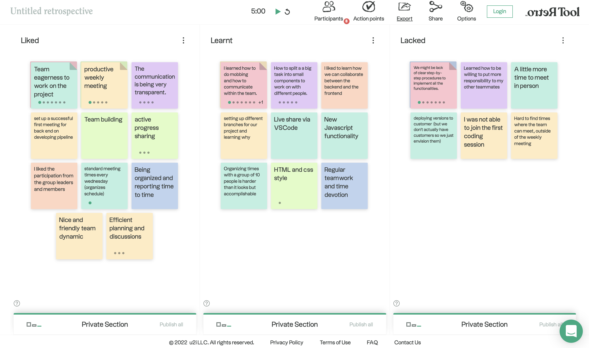

## Meeting Minutes
# Team 1: The Bold Ones

#### Date: *Wednesday, November 14th, 2022*
#### Time: *2:00pm - 3:00pm*
#### Place: *Zoom*

 

### Attendance List
- [x] Aleksandra (Ola) Desens
- [x] Stanley Alexander Woo
- [x] Delvin Bajoua
- [x] Nathaniel (Nathan) Susabda
- [x] Vincent Liang
- [x] Yanxiong (Devin) Chen
- [x] Zichen (Ash) Zhou
- [x] Alf Berger Husem
- [x] Pratham Mittal
- [x] Sidharth Kumar

### Agenda
* Retrospective meeting

### Liked
* Team dynamics and everyone's eagerness to work on the project
* Productive weekly in-person meetings
* Transparent communication between team members

### Learnt
* Mobbing programming
* Splitting tasks into smaller components and divide workload between people

### Lacked
* Step-by-step procedures on how to implement the application

