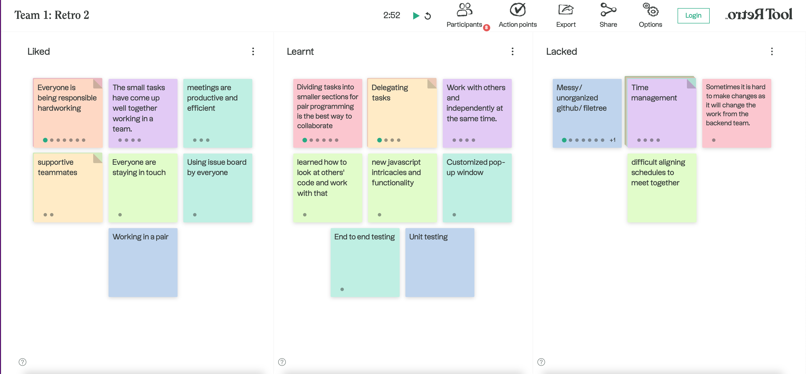

## Meeting Minutes
# Team 1: The Bold Ones

#### Date: *Wednesday, November 14th, 2022*
#### Time: *2:00pm - 3:00pm*
#### Place: *Zoom*

 

### Attendance List
- [x] Aleksandra (Ola) Desens
- [x] Stanley Alexander Woo
- [x] Delvin Bajoua
- [x] Nathaniel (Nathan) Susabda
- [ ] Vincent Liang
- [x] Yanxiong (Devin) Chen
- [x] Zichen (Ash) Zhou
- [x] Alf Berger Husem
- [x] Pratham Mittal
- [x] Sidharth Kumar

### Agenda
* Retrospective meeting

### Liked
* Everyone being responsible and working on tasks
* staying in touch and communicating well 
* using issue boards to track status and progress

### Learnt
* Dividing tasks into smaller pieces for pair programming 
* Delegating tasks
* new features/language-specific concepts 
* unit/end to end testing

### Lacked
* disorganized filetree/github
* Time pressure/management
* Difficulty coordinating times to meet with group members

